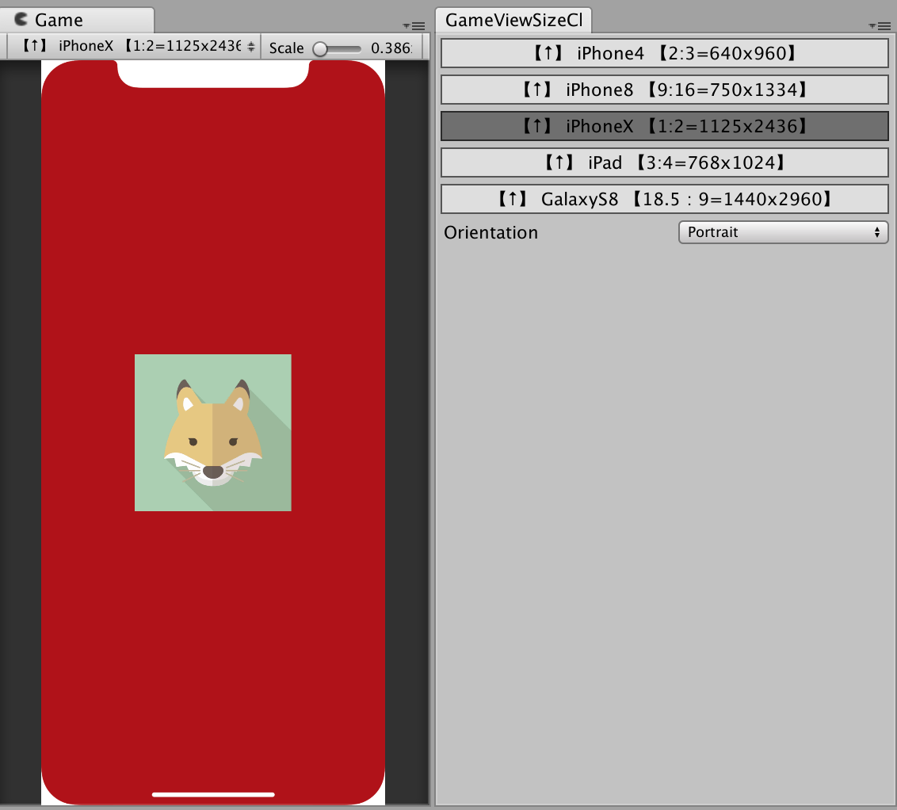

# GameViewSize Changer

Easily change GameViewSize in Unity

## Feature
* Change GameViewSize
* Register the screen size of a representative smartphone terminal in GameViewSize.
* Draw iPhoneX frame

## Usage
1. import GameViewSizeChanger.unitypackage
2. MenuItem "Window/GameViewSizeChanger"
3. Select Button

## Update Preset
Please rewrite "GameViewSizeChanger.cs" or Make a issue [GameViewSizeChanger issue](https://github.com/Syy12345-Unity/GameViewSizeChanger/issues)

## Use Library
* [unity-GameViewSizeHelper](https://github.com/anchan828/unity-GameViewSizeHelper)

## Licence

[MIT](LICENSE)

## Author

[Syy9](https://github.com/Syy9)
